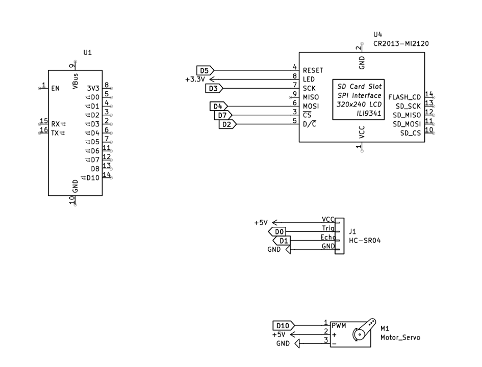

### 天兵一型防窺雷達 (WIP)

這是採用ESP32-C3 supermini開發版所設計的桌上型雷達/聲納系統。 
該系統透過ESP32-C3內建WIFI與個人主機連線，並在偵測到物體靠近時，將切換螢幕的指令傳遞給個人主機，以達到防止偷窺的目的。

本專案採用的硬體配件如下：
偵測器採用HC-SR04，最大偵測範圍為400cm。 
螢幕採用ST7735 TFT LCD，1.8吋。 
伺服馬達採用 SG90 Servo。 
杜邦線若干條。 
麵包版或電木板一片。 

電路原理圖如下：

組裝完成之後，分別撰寫並燒錄ESP32韌體(*Radar_New_02_AP4_7_2.ino*)，以及準備可在電腦端執行之檔案(*screenSwitcher.py* & *start.bat*)後即可。

示意圖如下：

電腦端介面如下：

